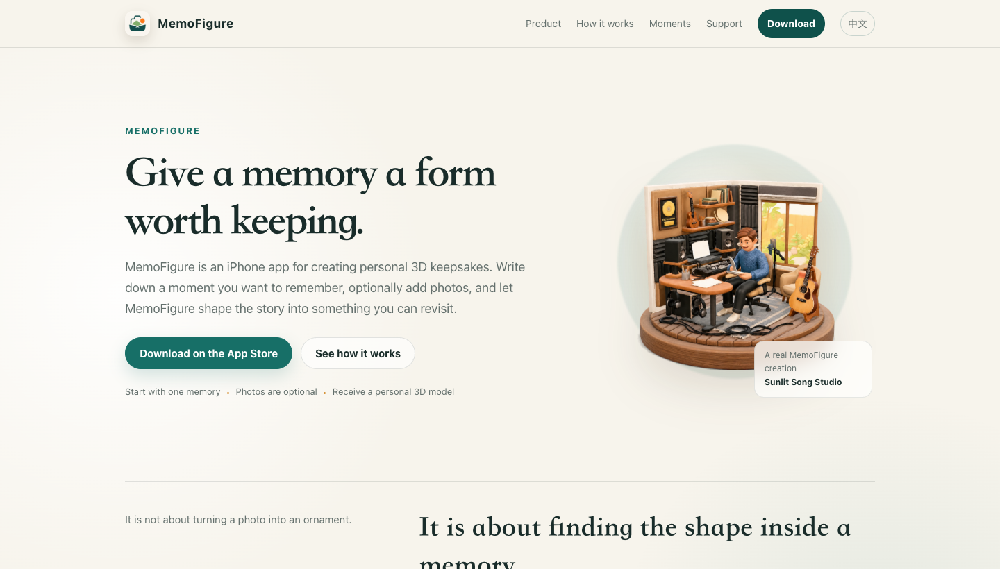
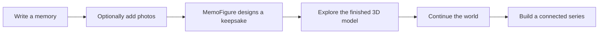
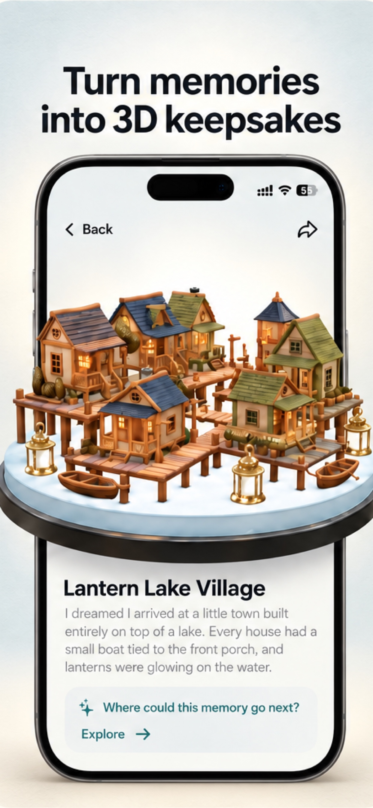
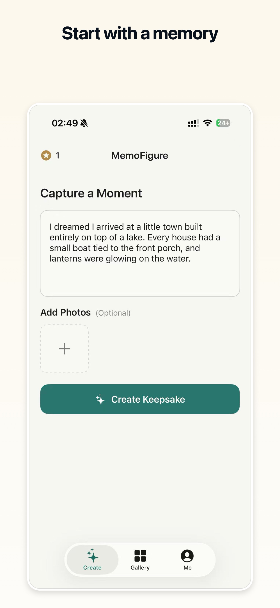
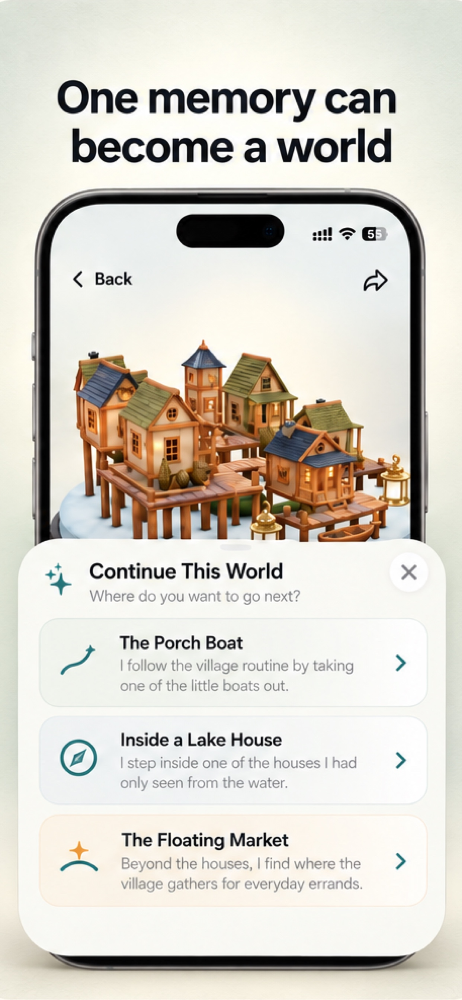
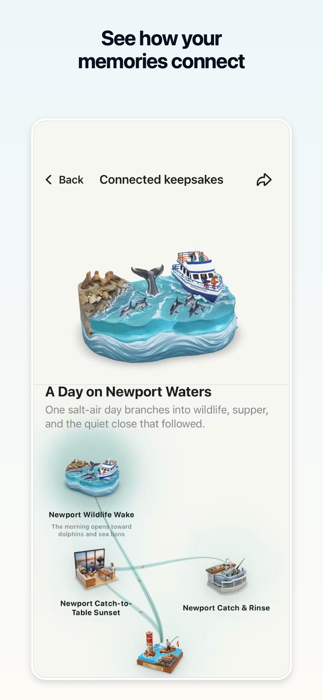
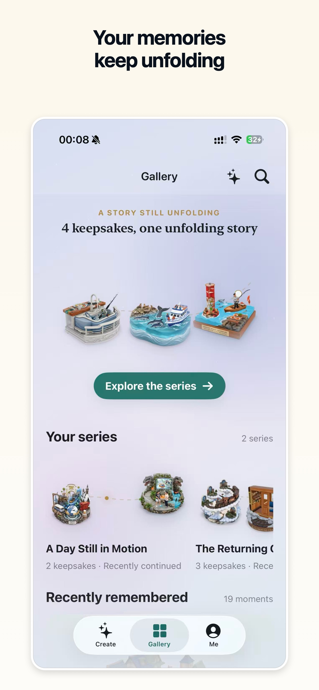
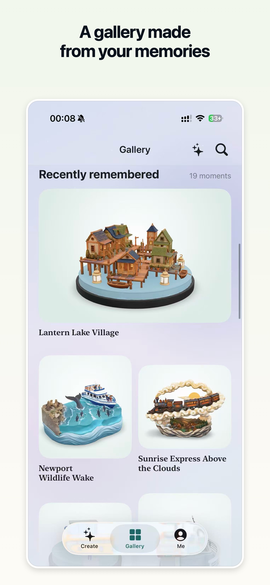

  

<h1 align="center">MemoFigure</h1>

<strong>Give a memory a form worth keeping.</strong>

  <a href="https://apps.apple.com/us/app/memofigure/id6787197327"><strong>Download on the App Store</strong></a>
  ·
  <a href="https://www.memofigure.com/en"><strong>Official website</strong></a>
  ·
  <a href="https://www.memofigure.com/en/support"><strong>Support</strong></a>

  

MemoFigure is an iPhone app that turns a written memory—and optional photos—into a personal 3D keepsake. People can revisit the finished model, continue the memory in new directions, and grow related keepsakes into a connected series.

This public repository is a product showcase. It presents the experience and design of MemoFigure without publishing its implementation.

## Product experience

MemoFigure keeps the experience deliberately simple. A person writes naturally, adds photos only when useful, and returns to a keepsake made from that memory.

## Selected product screens

  
  
  

  
  
  

## My role

- Created the product concept and designed the end-to-end experience.
- Built and launched the MemoFigure iPhone app.
- Designed the visual identity, interaction system, and connected-keepsake experience.
- Created the official website and App Store presentation.

Read the [product story](docs/CASE_STUDY.md) for the ideas behind the experience.

## Principles

- **Start with ordinary language.** People should describe a memory, not learn prompt syntax.
- **Photos stay optional.** The story remains the core input.
- **Make the process understandable.** Creative work should feel calm and clear.
- **Make the result revisitable.** A keepsake belongs in a personal collection rather than disappearing after generation.
- **Let memories grow.** A finished keepsake can become the beginning of a connected series.

## About this repository

This repository contains portfolio documentation and public marketing images only. The complete MemoFigure source repository remains private. No open-source license is granted; see [NOTICE](NOTICE.md).
